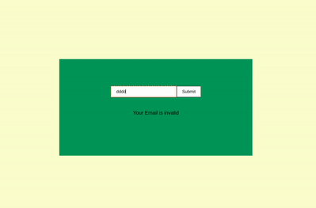
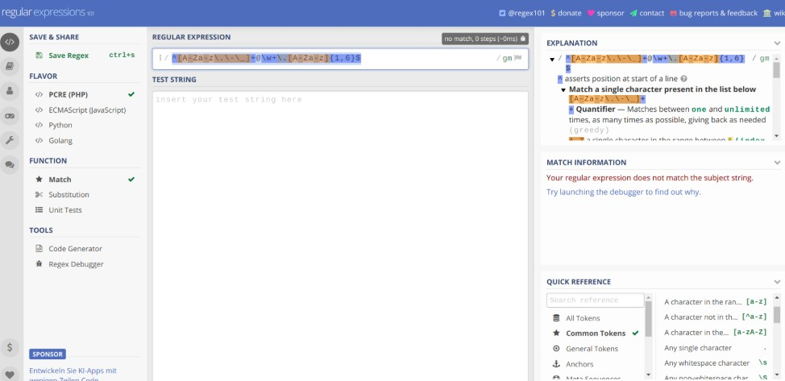

## REGULAR EXPRESSIONS

### REGEX for beginners

[](https://regexr.com/)

<br>
<br>

#### WHAT IS REGEX USED FOR?

<p>Short for regular expression, a regex is a string of text that allows you to create patterns that help match, locate, and manage text. </p>

<p>Short for regular expression, a regex is a string of text that allows you to create patterns that help match, locate, and manage text. </p>

```javascript

A - Z rANGE. Matches a character in range "A" to "Z" (char code 65 to 90). case sensitive
```

<br>


<p>A regular expression (regex or regexp for short) is a special text string for describing a search pattern. You can think of regular expressions as wildcards on steroids. You are probably familiar with wildcard notations such as *.txt to find all text files in a file manager. The regex equivalent is ^.*\.txt$.

But you can do much more with regular expressions. In a text editor like EditPad Pro or a specialized text processing tool like PowerGREP, you could use the regular expression \b[A-Z0-9._%+-]+@[A-Z0-9.-]+\.[A-Z]{2,}\b to search for an email address. Any email address, to be exact. A very similar regular expression (replace the first \b with ^ and the last one with $) can be used by a programmer to check whether the user entered a properly formatted email address. In just one line of code, whether that code is written in Perl, PHP, Java, a .NET language, or a multitude of other languages.</p>


<p>WRITE your REGEX here: </p>

[](https://regex101.com/)

<br>

